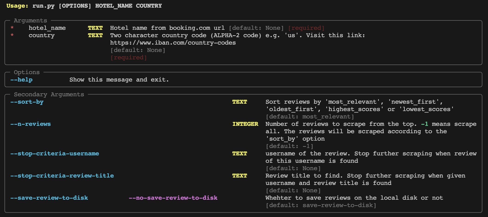

# Booking.com Reviews Scrapper


A Python tool to scrape cusotmer reviews from Booking.com. Whether you're a data enthusiast or looking to analyze customer feedback, this tool makes it easy to gather reviews data.


## Features

- Retrieve hotel reviews from booking.com
- Sort reviews by most_relevant, newest_first, oldest_first, highest_scores or lowest_scores
- Specify the number of reviews to scrape
- Specify a stopping criteria (e.g Rather than scraping all the reviews until the end, terminate the scraping process when a specific username or review is encountered. see **data_models.py**)
- Save reviews to your local disk
- Easy-to-use CLI

## Usage

Use the command-line interface (CLI) to start scraping booking.com Reviews. 

Run the below command to see the list of Required and Optional parameters.
```bash
python run.py --help
```



**As you can see there are two required parameters *'hotel_name'* and *'country'*. In order to get the hotel_name do the following:**

1. Go to Booking.com
2. Search your hotel by name. Lets say you searched 'Paramount Hotel Times Square'. Now go to hotel page.
3. Now you are on the hotel page. Get the url of this hotel page from the browser. In the current example you should have something like this "https://www.booking.com/hotel/us/paramount-new-york.en-gb.html..."
4. From this url, get the string that is betweeen 'en-gb.html' and '/us/'. In this case it is **'paramount-new-york'**. This will be the value of **hotel_name** parameter. 
5. **'us'** is the value of the **country** parameter. You can use it from here or simply visit https://www.iban.com/country-codes and copy the alpha-2 code of your desired country.


Here are some examples:

```bash
python python run.py 'paramount-new-york' 'us'
```
The above command will scrape all the reviews till the end. (default sort_by option 'most_relevant' will be used)

```bash
python run.py 'paramount-new-york' 'us' --sort-by 'newest_first' --n-reviews 20
```
The above command with sort the reviews by 'newest_first' and then scrape the top 20 reviews


```bash
python run.py 'paramount-new-york' 'us' --stop-criteria-username 'Mr.Nice' --stop-criteria-review-title 'It's a good choice. Generally comfy and location-wise.'
```
The above command will only stop scraping when the mentioned username with review_title is found.  (default sort_by option 'most_relevant' will be used)


## Output
It produces two csv files in the output directory configured in the config.yml "output_dir" field. Below is the example of output path in the config.yml

```yml
output_dir: "<my_output_directory_path>"
```

Below file is produced with following fields:

found_helpful,found_unhelpful,owner_response

#### reviews_<sort_by>.csv
This file contains review text and related fields. The produced fields are:

| Field             | Description                                                         |
| ----------------- | ------------------------------------------------------------------- |
| username          | Username of the reviewer on booking.com |
| user_country      | Country of the reviewer |
| room_view         | Room view or type, of the user e.g. 'Superior Room with Two Double Beds' |
| stay_duration     | Stay duration of the user in terms of number of nights |
| stay_type         | Traveller's stay type e.g. Group, Solo traveller, Family... |
| review_post_date  | Date on which the review was posted |
| review_title      | Review title written by the reviewer |
| rating            | Overall rating given by the reviewer, out of 10 |
| original_lang     | Original language of the review/reviewer |
| review_text_liked | Review section showing the comments of the reviewer about the things he liked |
| review_text_disliked | Review section showing the comments of the reviewer about the things he disliked |
| full_review       | Field containing combined text of [review_title, review_text_liked, review_text_disliked]  |
| en_full_review    | English translation of 'full_review', If the user language is en/en-US. otherwise Null |
| found_helpful     | Number of people that have found the review helpful |
| found_unhelpful   | Number of people that have found the review unhelpful |
| owner_resp_text   | Response of the hotel |


## Config
The structure of the yml files should be the following

```yml
REQUESTS_PER_SECOND: 10
MAX_RETIES: 3
HOTEL_REVIEWS_PAGE : "https://www.booking.com/reviewlist.en-gb.html"
OUTPUT_DIR: "<my_output_directory_path>"
```
- REQUESTS_PER_SECOND: How many review pages to request at a time. 
- MAX_RETIES: Maximum number to retries in order to get the reviews page.
- HOTEL_REVIEWS_PAGE: Baseurl for scraping hotel review pages
- OUTPUT_DIR: The directory where the output file/folders will be created

## Technical Detail
- Multi-Threading is used to request multiple review pages in parallel
- Multi-Processing is used to parse mutiple response objects in parallel

## Support the Project

If you find this project helpful and would like to support its development, you can Buy Me a Coffee.

<a href="https://www.buymeacoffee.com/hassanbest01" target="_blank"></a>

Your support is greatly appreciated!

## License
This project is licensed under the MIT License - see the LICENSE file for details.

## Contributing
Contributions are welcome! 

For support and inquiries, please open an issue on the GitHub repository.